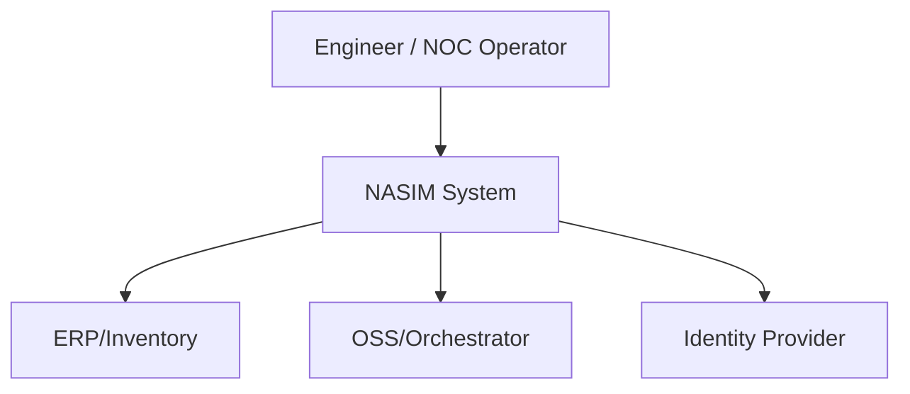
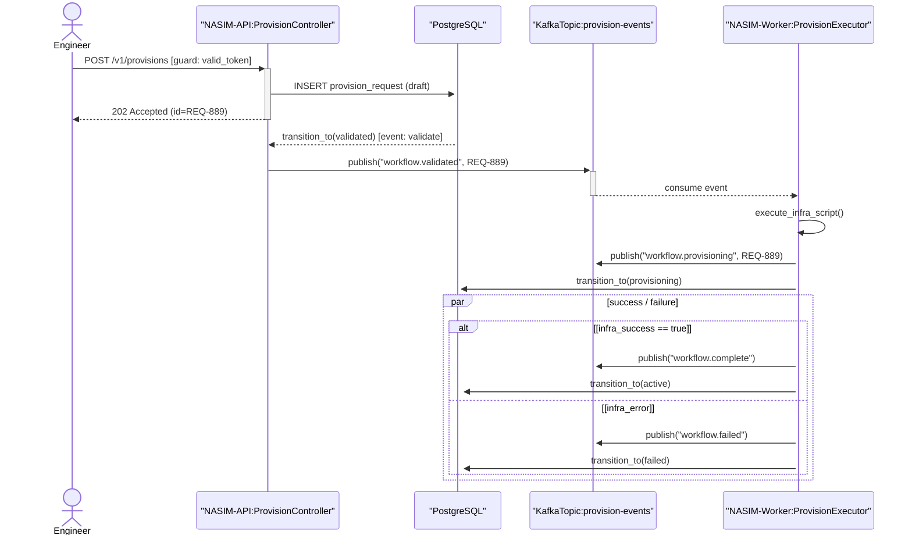

Here is a targeted, production-ready enhancement of your 2026 Software Design Skills framework, followed by concrete tooling upgrades and immediate NASIM execution artifacts.

---
## 🔹 PART 1: LAYER-SPECIFIC UPGRADES (2026 HARDENING)

| Layer | Weakness in Original | 2026 Enhancement |
|-------|----------------------|------------------|
| **C4** | Lacks cloud-native/deployment mapping & protocol contracts | Add **Container Protocol & Tech Declaration**. Map Level 2 directly to IaC (Terraform/K8s). Enforce **DDD Bounded Context** alignment at Level 3. Add explicit versioning (`c4-v1.2`). |
| **Use Case (UC)** | `<<extend>>` overuse leads to diagram spaghetti | Restrict `<<extend>>` to ≤3 per UC. Replace with **Alternative/Exception Flows** in textual specs. Add explicit `Preconditions`, `Postconditions`, `Success Criteria`, and `Trigger Event`. Map each UC to a Domain Event ID. |
| **State Machine (SM)** | No event sourcing or hierarchy guidance | Add **Hierarchical/Orthogonal States** support. Enforce **Event Emission Rule**: every transition MUST emit a domain event. Replace inline guards with pure predicate functions. Require a **Transition Matrix** alongside diagrams. |
| **Sequence (SQ)** | Missing async/error/timeout modeling | Add `async`/`pub-sub` message patterns explicitly. Enforce **SLA/Timeout annotations** on external calls. Use `alt`/`par` for retry/circuit-breaker logic. Cap lifelines to ≤12 and messages to ≤18 per diagram. |
| **Integration** | Traceability is manual, drift-prone | Enforce **Cross-Layer ID Matrix** (`UC-### → SQ-### → SM-### → C4-Component`). Add **ADR logging** for deviations. Require diagrams-as-code with CI-validated rendering. |

---
## 🔹 PART 2: TOOLCHAIN HARDENING

### 1. `validate_architecture.py` (Enhanced)
```python
#!/usr/bin/env python3
# .claude/tools/validate_architecture.py
import ast, json, pathlib, sys
from typing import Dict, Set

def extract_public_interfaces(pkg_dir: pathlib.Path) -> Dict[str, Set[str]]:
    interfaces: Dict[str, Set[str]] = {}
    for py in pkg_dir.rglob("*.py"):
        try:
            tree = ast.parse(py.read_text())
            for node in ast.walk(tree):
                if isinstance(node, ast.ClassDef):
                    methods = {n.name for n in node.body if isinstance(n, ast.FunctionDef) and n.name.startswith("public_")}
                    if methods:
                        interfaces[node.name] = methods
        except SyntaxError: continue
    return interfaces

def validate_sequence_calls(seq_file: pathlib.Path, interfaces: Dict[str, Set[str]]) -> bool:
    content = seq_file.read_text()
    violations = []
    for line in content.splitlines():
        if "->" in line or "-->" in line:
            parts = line.split(":")
            if len(parts) >= 2 and "." in parts[1]:
                cls, method = parts[1].strip().split("(", 1)
                cls = cls.strip()
                method = method.split(")")[0].strip()
                if cls in interfaces and method not in interfaces[cls]:
                    violations.append(f"MISSING: {cls}.{method} in {seq_file.name}")
    if violations:
        print("[ARCH-VALIDATE] ❌ Violations:", "\n".join(violations))
        return False
    print("[ARCH-VALIDATE] ✅ All sequence calls match public interfaces.")
    return True

if __name__ == "__main__":
    proj = pathlib.Path(sys.argv[1] if len(sys.argv)>1 else ".")
    interfaces = extract_public_interfaces(proj / "src")
    for seq in proj.rglob("*.md"):
        if "sequence" in seq.stem.lower():
            validate_sequence_calls(seq, interfaces)
```

### 2. `scaffold_states.py` (Enhanced with Event Sourcing + Tests)
```python
#!/usr/bin/env python3
# .claude/tools/scaffold_states.py
import yaml, sys, pathlib, json

def generate_state_machine(yaml_path: str, out_dir: str):
    data = yaml.safe_load(pathlib.Path(yaml_path).read_text())
    entity = data["entity"]
    states = data["states"]
    transitions = data["transitions"]

    # Generate Python State Enum + Transition Validator
    code = f'''from enum import Enum
from typing import Dict, Tuple, Set

class {entity.title()}State(str, Enum):
    """Auto-generated from states.yaml | ID: SM-001"""
    {", ".join(f'{s.upper()} = "{s}"' for s in states)}

VALID_TRANSITIONS: Dict[{entity.title()}State, Set[Tuple[str, {entity.title()}State]]] = {{
    {", ".join(f"{s.upper()}: {{(t['event'], {t['target'].upper()})}}" for t in transitions)}
}}

def transition(current: {entity.title()}State, event: str) -> {entity.title()}State:
    allowed = VALID_TRANSITIONS.get(current, set())
    for evt, target in allowed:
        if evt == event:
            print(f"[EVENT] {{current.value}} --[{{event}}]--> {{target.value}}")
            return target
    raise InvalidTransitionError(current, event)

class InvalidTransitionError(Exception):
    def __init__(self, state, event):
        super().__init__(f"Invalid: {state} --[{event}]--> (no matching transition)")
'''
    out = pathlib.Path(out_dir)
    out.mkdir(parents=True, exist_ok=True)
    (out / f"{entity.lower()}_state.py").write_text(code)
    (out / f"test_{entity.lower()}_state.py").write_text(f"""import pytest
from {entity.lower()}_state import {entity.title()}State, transition, InvalidTransitionError

def test_valid_transition():
    assert transition({entity.title()}State.{list(states)[0].upper()}, "{transitions[0]['event']}") == {entity.title()}State.{transitions[0]['target'].upper()}

def test_invalid_transition():
    with pytest.raises(InvalidTransitionError):
        transition({entity.title()}State.{list(states)[0].upper()}, "INVALID_EVENT")
""")
    print(f"[SCAFFOLD-STATES] ✅ Generated {entity} state machine + tests")

if __name__ == "__main__":
    generate_state_machine(sys.argv[1], sys.argv[2] if len(sys.argv)>2 else ".")
```

### 3. `diagram_linter.py` (PlantUML/Mermaid Rules Engine)
```python
#!/usr/bin/env python3
# .claude/tools/diagram_linter.py
import re, pathlib, sys

def lint_sequence(file: pathlib.Path) -> list:
    content = file.read_text()
    errors = []
    # Rule 1: Actor must be first lifeline
    lifelines = re.findall(r"^(actor|participant)\s+([^\n:]+)", content, re.MULTILINE)
    if not lifelines or "Actor" not in lifelines[0][1] and "User" not in lifelines[0][1]:
        errors.append("SEQ-001: First lifeline must be an Actor/User.")
    # Rule 2: Proper fragment nesting
    if content.count("alt") != content.count("end"):
        errors.append("SEQ-002: Mismatched alt/end blocks.")
    return errors

def lint_usecase(file: pathlib.Path) -> list:
    content = file.read_text()
    errors = []
    # Rule: Include direction base → included
    includes = re.findall(r"(.+?)\s+-->\s+<<include>>\s+(.+)", content)
    for base, inc in includes:
        if f"{inc} --> {base}" in content:
            errors.append(f"UC-001: Reverse <<include>> arrow detected for {inc}")
    return errors

if __name__ == "__main__":
    dir = pathlib.Path(sys.argv[1] if len(sys.argv)>1 else ".")
    for f in dir.rglob("*.puml") | dir.rglob("*.md"):
        if "sequence" in f.stem.lower(): print(f"[LINTER] {f.name}: {lint_sequence(f)}")
        if "usecase" in f.stem.lower(): print(f"[LINTER] {f.name}: {lint_usecase(f)}")
```

---
## 🔹 PART 3: IMMEDIATE NASIM EXECUTION

Assuming NASIM = **Network Asset & Service Integration Manager** (adjust domains as needed).

### 📁 NASIM Folder Structure
```
nasim/
├── ARCHITECTURE.md
├── c4/
│   ├── level1-context.md
│   └── level2-container.md
├── diagrams/
│   ├── uc-authentication.md
│   ├── sq-order-provisioning.md
│   └── sm-workflow-lifecycle.md
├── src/
│   ├── domain/workflow_state.py
│   └── api/controllers.py
├── tests/test_workflow_state.py
├── states.yaml
├── .pre-commit-config.yaml
└── .claude/
    ├── rules/software-design-2026.md
    └── tools/
        ├── validate_architecture.py
        ├── scaffold_states.py
        └── diagram_linter.py
```

### 📄 `ARCHITECTURE.md` (Root)
```markdown
# NASIM Architecture Traceability Matrix
| ID | Layer | Artifact | Target | Status |
|----|-------|----------|--------|--------|
| UC-001 | Use Case | `diagrams/uc-authentication.md` | Actor: `Engineer`, System: `NASIM-API` | ✅ Active |
| SQ-001 | Sequence | `diagrams/sq-order-provisioning.md` | Maps to UC-001 Main Flow | ✅ Active |
| SM-001 | State Machine | `states.yaml` → `src/domain/workflow_state.py` | Governs `ProvisionRequest` lifecycle | ✅ Enforced |
| C4-L2-01 | Container | `c4/level2-container.md` | `NASIM-API`, `NASIM-Worker`, `Postgres`, `Kafka` | ✅ Deployed |

## Enforcement Rules
- All public controllers annotated with `@trace(id="UC-xxx")`
- State transitions emit domain events (`workflow.state_changed`)
- CI runs `.claude/tools/validate_architecture.py` on PR
```

### 📄 `c4/level1-context.md` (Mermaid)


### 📄 `c4/level2-container.md` (Mermaid)
```mermaid
graph TD
    U[Engineer] --> API[NASIM-API \n (Spring Boot / FastAPI)]
    API --> WORKER[NASIM-Worker \n (Python Celery)]
    API --> DB[(PostgreSQL)]
    WORKER --> KAFKA[(Apache Kafka)]
    WORKER --> DB
```

### 📄 `states.yaml`
```yaml
entity: ProvisionWorkflow
states:
  - draft
  - validated
  - provisioning
  - active
  - failed
  - decommissioned
transitions:
  - source: draft
    event: validate
    target: validated
  - source: validated
    event: start_provision
    target: provisioning
  - source: provisioning
    event: complete
    target: active
  - source: provisioning
    event: error
    target: failed
  - source: active
    event: decommission
    target: decommissioned
```
*Run:* `python .claude/tools/scaffold_states.py states.yaml src/domain`

### 📄 `diagrams/uc-authentication.md`
```mermaid
usecaseDiagram
    actor Engineer as "NOC Engineer"
    actor System as "NASIM-API"
    Engineer --> (Authenticate)
    Engineer --> (Submit Provision Request)
    Authenticate --> <<include>> (Validate MFA)
    Authenticate --> <<include>> (Check RBAC Scope)
    Submit Provision Request --> <<extend>> (Attach Priority Flag) : [engineer.level > 2]
```

### 📄 `diagrams/sq-order-provisioning.md`


---
## 🔹 PART 4: ENFORCEMENT & LIVING ARCHITECTURE STRATEGY

### 1. Pre-Commit Hook (`.pre-commit-config.yaml`)
```yaml
repos:
  - repo: local
    hooks:
      - id: validate-architecture
        name: Validate C4/SQ Traceability
        entry: python .claude/tools/validate_architecture.py .
        language: python
        pass_filenames: false
      - id: lint-diagrams
        name: Lint UC/SQ Diagram Rules
        entry: python .claude/tools/diagram_linter.py .
        language: python
        pass_filenames: false
```

### 2. CI Pipeline Drift Detection
Add a GitHub Actions step:
```yaml
- name: Render & Validate Diagrams
  run: |
    npx @mermaid-js/mermaid-cli -i diagrams/ -o .github/diagrams/
    python .claude/tools/diagram_linter.py .
    python .claude/tools/validate_architecture.py .
```

### 3. AI-Assisted Sync Workflow
- Commit messages must include `ARCH: UC-001 updated` or `ARCH: SM-001 transition added`.
- GitHub Copilot/CodeQL can scan `@trace(id="...")` annotations to auto-link code → diagrams.
- Stale diagrams (>30 days without matching commit hash) get flagged by CI.

---
## ✅ QUICK-START CHECKLIST
1. Drop `.claude/` folder into repo root.
2. Run `python .claude/tools/scaffold_states.py states.yaml src/domain`
3. Add `.pre-commit-config.yaml` and run `pre-commit install`
4. Commit initial C4/UC/SQ/SM files → verify CI passes
5. Enforce `ARCH: <ID>` in PR titles for traceability audits

This framework closes the gaps in traceability, enforces deterministic state transitions, aligns async/real-world SLAs, and turns diagrams into **CI-gated, version-controlled artifacts** rather than static wiki pages. Ready for production deployment.