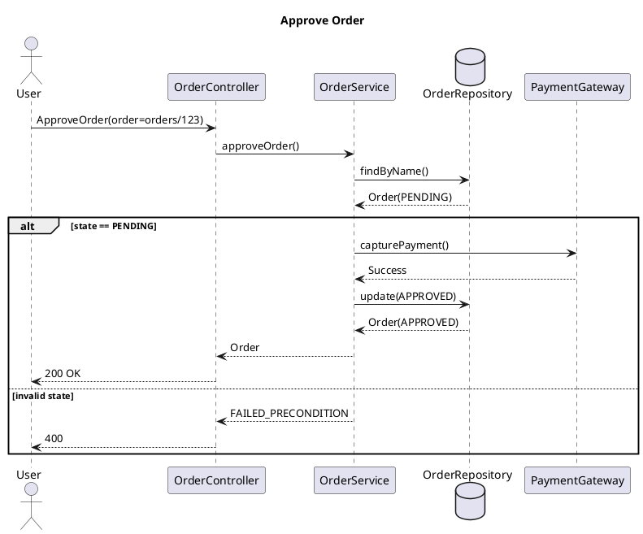

Yes. If you are standardizing sequence diagrams for an AI agent that designs systems using:

1. **Controller → Service → Repository (CSR) architecture**
2. **Google Resource-Oriented Design (RoD / AIP)**

then the sequence diagram rules should not merely describe message flows. They should become an **architectural validation artifact** that ensures:

* Correct layer boundaries
* Correct API method semantics
* Correct resource lifecycle handling
* Correct transaction boundaries
* Correct state transitions
* Correct error propagation
* Correct ownership of business logic

The goal is:

> A sequence diagram should prove that a use case complies with CSR architecture and Google AIP resource-oriented API design.

---

# Sequence Diagram Skill

## Purpose

Use sequence diagrams to model:

* Request flow
* Layer responsibilities
* Resource lifecycle
* State transitions
* Error handling
* External integrations

Sequence diagrams MUST validate architectural correctness, not merely show call order.

---

# Core Modeling Layers

Every sequence diagram participant must belong to one of these categories.

## Client

Actor initiating request.

Examples:

* User
* Web UI
* Mobile App
* External System

PlantUML

```plantuml
actor User
```

---

## Controller

API boundary.

Responsibilities:

* Authentication
* Authorization
* Request validation
* DTO mapping
* HTTP/gRPC translation

Must NOT:

* Contain business logic
* Access database directly

PlantUML

```plantuml
participant Controller
```

---

## Service

Business orchestration layer.

Responsibilities:

* Business rules
* State transitions
* Transactions
* Workflow orchestration

Must NOT:

* Know persistence details
* Execute SQL

PlantUML

```plantuml
participant Service
```

---

## Repository

Persistence abstraction.

Responsibilities:

* Resource retrieval
* Resource persistence

Must NOT:

* Execute business rules
* Trigger workflows

PlantUML

```plantuml
database Repository
```

---

## External Systems

Anything outside ownership boundary.

Examples:

* Payment Gateway
* Email Provider
* AI Model

PlantUML

```plantuml
participant PaymentProvider
```

---

# Layer Interaction Rules

## Rule CSR-1

Controller may call Service only.

Allowed:

```text
Controller -> Service
```

Forbidden:

```text
Controller -> Repository
```

---

## Rule CSR-2

Service may call:

```text
Repository
Other Services
External Systems
```

---

## Rule CSR-3

Repository never calls Service.

Forbidden:

```text
Repository -> Service
```

---

## Rule CSR-4

Business decisions belong only in Service.

If diagram contains:

```text
alt account suspended
```

inside Controller,

diagram is invalid.

---

# Resource-Oriented Design Rules

Based on AIP-121.

Every sequence diagram must identify:

```text
Resource
```

being manipulated.

Example:

```text
Order
Customer
Invoice
Ticket
```

---

## Rule ROD-1

Service operations must correspond to resource operations.

Examples:

```text
CreateOrder
GetOrder
ListOrders
UpdateOrder
DeleteOrder
```

not

```text
DoOrderStuff
HandleOrder
```

---

## Rule ROD-2

Sequence title must include resource.

Good:

```text
Create Order
```

Bad:

```text
Process Request
```

---

# Standard Method Mapping

From AIP-131–135.

---

## Create

```text
POST /orders
```

Sequence:

```text
Client
 -> Controller
 -> Service
 -> Repository.insert()
```

PlantUML

```plantuml
User -> OrderController : CreateOrderRequest
OrderController -> OrderService : createOrder()
OrderService -> OrderRepository : save()
OrderRepository --> OrderService : Order
OrderService --> OrderController : Order
OrderController --> User : 201 Created
```

---

## Get

```text
GET /orders/{id}
```

Must not modify state.

Sequence should show:

```text
Repository.find()
```

only.

---

## List

Must show:

```text
Pagination
Filtering
Sorting
```

per AIP-158.

PlantUML

```plantuml
User -> Controller : ListOrders(page_size,page_token)
```

---

## Update

Must show:

```text
resource
update_mask
```

per AIP-134.

---

## Delete

Must show:

```text
soft delete
hard delete
```

decision if relevant.

---

# Custom Method Rules

Based on AIP-136.

Custom methods must represent domain actions.

Example:

```text
ApproveOrder
CancelOrder
ShipOrder
```

Not:

```text
UpdateStatus
```

because that hides intent.

---

# State Transition Modeling

Based on AIP-216.

Every state-changing operation should show:

```text
Current State
Target State
```

Example:

```plantuml
alt Order = PENDING
    Service -> Service : transition(PENDING->APPROVED)
else Invalid State
    Service --> Controller : FAILED_PRECONDITION
end
```

---

# Error Modeling Rules

Based on AIP-193.

Every sequence diagram must model significant errors.

---

## Validation Error

Controller responsibility.

```plantuml
alt invalid request
    Controller --> User : INVALID_ARGUMENT
end
```

---

## Not Found

Repository responsibility.

```plantuml
Repository --> Service : NotFound
```

---

## Business Rule Failure

Service responsibility.

```plantuml
Service --> Controller : FAILED_PRECONDITION
```

---

## Authorization Failure

Controller responsibility.

```plantuml
Controller --> User : PERMISSION_DENIED
```

---

# Transaction Rules

Transactions belong in Service.

Good:

```plantuml
group Transaction
Service -> Repository : createOrder()
Service -> Repository : reserveInventory()
end
```

Bad:

```plantuml
Controller -> Repository
```

---

# Resource Naming Rules

Based on AIP-122.

Resource names must appear explicitly.

Example:

```text
orders/{order}
customers/{customer}
```

PlantUML

```plantuml
User -> Controller : GetOrder(name=orders/123)
```

Not:

```text
id=123
```

unless internal repository call.

---

# Repository Modeling Rules

Repository operations should reflect persistence semantics.

Preferred:

```text
findByName()
findById()
save()
update()
delete()
```

Avoid:

```text
process()
handle()
execute()
```

---

# External Integration Rules

External systems never communicate directly with Repository.

Good:

```text
Service -> PaymentProvider
```

Bad:

```text
Repository -> PaymentProvider
```

---

# Diagram Structure Template

Every diagram should follow:

```text
1. Request received
2. Validation
3. Business orchestration
4. State validation
5. Repository interaction
6. External integration
7. Persistence
8. Response
9. Error paths
```

---

# Recommended PlantUML Skeleton



---

# Agent Checklist (Architectural Linter)

Before accepting a sequence diagram, an agent should verify:

### CSR Compliance

* [ ] Controller never accesses Repository
* [ ] Business rules only in Service
* [ ] Repository only performs persistence
* [ ] External systems called from Service

### RoD Compliance

* [ ] Resource identified
* [ ] Resource name follows AIP-122
* [ ] Standard method uses AIP semantics
* [ ] Custom methods represent domain actions
* [ ] State transitions modeled
* [ ] Pagination modeled for List
* [ ] UpdateMask modeled for Update
* [ ] Error codes follow AIP-193

### Sequence Quality

* [ ] Main success path present
* [ ] Alternative flows modeled
* [ ] Error paths modeled
* [ ] Transaction boundaries visible
* [ ] State transitions explicit
* [ ] No hidden business logic

This transforms sequence diagrams from simple interaction sketches into **architecture-governance artifacts** that enforce both CSR layering and Google AIP resource-oriented design.
