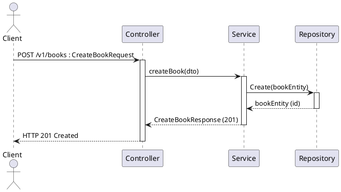

### Overview
**Goal:** Provide a reusable skill set, rules, and step‑by‑step workflow an agent can use to generate clear, consistent UML sequence diagrams for backend flows that follow the **Controller–Service–Repository (CSR)** pattern and **Resource‑Oriented Design (RoD)** principles.  
**Outputs:** PlantUML-ready sequence diagrams, a validation checklist, and a small library of canonical fragments (sync/async calls, error handling, pagination, long‑running ops).  
Sequence diagrams show time‑ordered interactions between participants and are ideal for modeling use‑case scenarios and API interactions.   [visual-paradigm.com](https://www.visual-paradigm.com/guide/uml-unified-modeling-language/what-is-sequence-diagram/)

---

### Mapping Rules Controller Service Repository and Resource Oriented Design
| **Concept** | **Sequence Diagram Element** | **Notation / Rule** |
|---|---:|---|
| **Controller** | **Client lifeline or API Gateway lifeline** | Represent as the entry lifeline that receives external actor requests; show HTTP method as message label (e.g., `POST /v1/books`).   [wiki.sitblueprint.com](https://wiki.sitblueprint.com/books/technical-resources/page/introduction-to-backend-development#bkmrk-controller-service-r) |
| **Service** | **Service lifeline** | Place between Controller and Repository; show business logic as activations on this lifeline; use DTOs on messages.   [wiki.sitblueprint.com](https://wiki.sitblueprint.com/books/technical-resources/page/introduction-to-backend-development#bkmrk-controller-service-r) |
| **Repository** | **Repository or DataStore lifeline** | Represent persistence interactions; use `Create`, `Get`, `List`, `Update`, `Delete` message labels to match RoD standard methods.   [google.aip.dev](https://google.aip.dev/121) |
| **Resource** | **Resource lifeline or resource collection lifeline** | Model resources as nouns (e.g., `Book`, `Publisher`); use resource URIs in message labels and ensure schema consistency across methods.   [google.aip.dev](https://google.aip.dev/121) |
| **Custom method** | **POST to resource subpath** | Use `POST /v1/books:import` style message for custom operations; show as synchronous or async depending on behavior.   [google.aip.dev](https://google.aip.dev/121) |
| **Async events / logging** | **Asynchronous message** | Use open arrowheads for async messages (e.g., `->> LoggingService: logEvent`).   [chat.visual-paradigm.com](https://chat.visual-paradigm.com/docs/uml-sequence-diagram-a-definitive-guide-to-modeling-interactions-with-ai/)  [plantuml.com](https://plantuml.com/sequence-diagram) |
| **Fragments for logic** | **alt / loop / opt fragments** | Use combined fragments to show branching, loops, and optional flows.   [visual-paradigm.com](https://www.visual-paradigm.com/guide/uml-unified-modeling-language/what-is-sequence-diagram/) |

---

### Notation Conventions and PlantUML Templates
**Conventions**
- **Lifeline order:** left-to-right by role: *Actor → Controller → Service → Repository → External Services*.   [visual-paradigm.com](https://www.visual-paradigm.com/guide/uml-unified-modeling-language/what-is-sequence-diagram/)  
- **Message labels:** include **HTTP method**, **resource path**, and **DTO name** (e.g., `POST /v1/books : CreateBookRequest`).   [google.aip.dev](https://google.aip.dev/121)  
- **Synchronous vs Asynchronous:** synchronous calls use solid arrow with reply dashed; asynchronous use `->>` with no immediate reply.   [chat.visual-paradigm.com](https://chat.visual-paradigm.com/docs/uml-sequence-diagram-a-definitive-guide-to-modeling-interactions-with-ai/)  [plantuml.com](https://plantuml.com/sequence-diagram)  
- **Errors and states:** model errors as dashed return messages with status code and error resource (e.g., `HTTP 404 NotFound`). Use AIP error guidance for canonical error semantics.   [google.aip.dev](https://google.aip.dev/121)

**PlantUML fragment for a simple CSR flow**

Use `alt`, `loop`, `opt` for branching and iteration.   [plantuml.com](https://plantuml.com/sequence-diagram)  [visual-paradigm.com](https://www.visual-paradigm.com/guide/uml-unified-modeling-language/what-is-sequence-diagram/)

---

### Workflow for an Agent to Produce a CSR + RoD Sequence Diagram
1. **Ingest scenario**  
   - Extract *actor*, *entry endpoint* (HTTP method + path), *resource(s)*, and *intent* (create/read/update/delete/custom). Assume resource names follow RoD naming.   [google.aip.dev](https://google.aip.dev/121)
2. **Derive lifelines**  
   - Create lifelines: *Actor*, *Controller*, *Service*, *Repository*, plus any external services (auth, logging, payment). Order them left→right by invocation order.   [visual-paradigm.com](https://www.visual-paradigm.com/guide/uml-unified-modeling-language/what-is-sequence-diagram/)
3. **Map messages to methods**  
   - For each interaction, map to RoD standard methods where possible (`Get`, `List`, `Create`, `Update`, `Delete`). Use custom method URIs for nonstandard ops.   [google.aip.dev](https://google.aip.dev/121)
4. **Decide sync vs async**  
   - If the controller must wait for result (e.g., create returns resource), model synchronous. If fire‑and‑forget (e.g., logging, metrics), model asynchronous.   [chat.visual-paradigm.com](https://chat.visual-paradigm.com/docs/uml-sequence-diagram-a-definitive-guide-to-modeling-interactions-with-ai/)
5. **Add activations and fragments**  
   - Add activation bars for processing; wrap conditional logic in `alt`/`opt`; wrap retries or loops in `loop`.   [visual-paradigm.com](https://www.visual-paradigm.com/guide/uml-unified-modeling-language/what-is-sequence-diagram/)
6. **Annotate states and errors**  
   - Add return messages with HTTP status and error resource; for long‑running ops, show an initial `POST` returning `202` and a separate `Get` for status. Follow AIP states and errors guidance.   [google.aip.dev](https://google.aip.dev/121)
7. **Generate PlantUML and validate**  
   - Produce PlantUML text; run a layout pass (or rely on PlantUML) to ensure readability. Use the validation checklist below.   [plantuml.com](https://plantuml.com/sequence-diagram)

---

### Validation Checklist
- **Resource alignment:** Every message that creates/returns a resource uses the same resource schema name across methods.   [google.aip.dev](https://google.aip.dev/121)  
- **Standard methods used where possible:** Prefer `Get/List/Create/Update/Delete` before custom methods.   [google.aip.dev](https://google.aip.dev/121)  
- **Stateless interactions:** Each request message contains all required context; no implicit session state is assumed.   [google.aip.dev](https://google.aip.dev/121)  
- **Error modeling:** All error paths are shown with HTTP status and error resource; negative fragments (`neg`) used for invalid interactions if needed.   [google.aip.dev](https://google.aip.dev/121)  [visual-paradigm.com](https://www.visual-paradigm.com/guide/uml-unified-modeling-language/what-is-sequence-diagram/)  
- **Async clearly marked:** Asynchronous messages use open arrowheads and are not followed by immediate reply activations.   [chat.visual-paradigm.com](https://chat.visual-paradigm.com/docs/uml-sequence-diagram-a-definitive-guide-to-modeling-interactions-with-ai/)  
- **Fragments used for control flow:** Branches, loops, and optional flows are represented with `alt`, `loop`, `opt`.   [visual-paradigm.com](https://www.visual-paradigm.com/guide/uml-unified-modeling-language/what-is-sequence-diagram/)

---

### Canonical Examples and Patterns
#### Pagination List Pattern
- **Controller** receives `GET /v1/books?pageSize=50&pageToken=abc` → **Service** calls **Repository** `ListBooks(pageSize, pageToken)` → return `ListBooksResponse{books[], nextPageToken}`. Use `List` standard method semantics.   [google.aip.dev](https://google.aip.dev/121)

#### Long Running Operation Pattern
- **Controller** `POST /v1/exports` → returns `202 Accepted` with `operation` resource → client polls `GET /v1/operations/{id}` until `done=true`. Model as initial synchronous reply then separate polling lifeline.   [google.aip.dev](https://google.aip.dev/121)

#### Error and Retry Pattern
- Use `alt` fragment: first branch `on transient DB error` show retry loop; second branch `on permanent error` return `HTTP 500` with error resource.   [visual-paradigm.com](https://www.visual-paradigm.com/guide/uml-unified-modeling-language/what-is-sequence-diagram/)  [google.aip.dev](https://google.aip.dev/121)

---

### Quick Reference Prompts for an AI Agent
- **Generate diagram from user story:** “Create a sequence diagram for: *Actor* calls `POST /v1/books` to create a Book; validate input; persist; return `201` with resource.”  
- **Add RoD compliance check:** “Annotate each message with RoD method and verify Get/List/Create/Update/Delete usage.”  
- **Convert to PlantUML:** “Output PlantUML code with lifelines Controller, Service, Repository, and show async logging to LoggingService.”

---

### Closing Notes
- Use **RoD** to keep API interactions noun‑centric and to prefer standard methods; use **CSR** to structure the internal flow and keep responsibilities separated.   [google.aip.dev](https://google.aip.dev/121)  [wiki.sitblueprint.com](https://wiki.sitblueprint.com/books/technical-resources/page/introduction-to-backend-development#bkmrk-controller-service-r)  
- PlantUML is a practical target format for automated generation and quick iteration.   [plantuml.com](https://plantuml.com/sequence-diagram)

If you want, I can now generate a ready PlantUML sequence diagram for a specific endpoint or user story you provide, following the rules above.