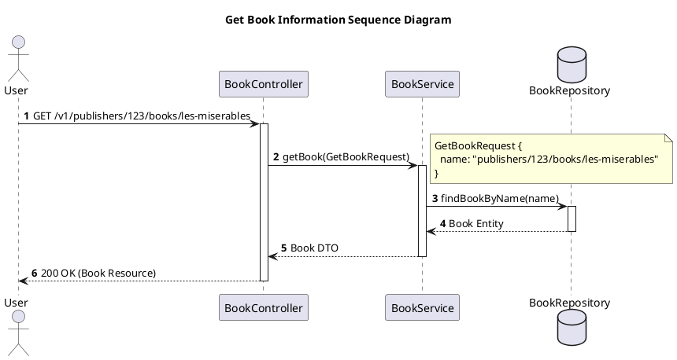
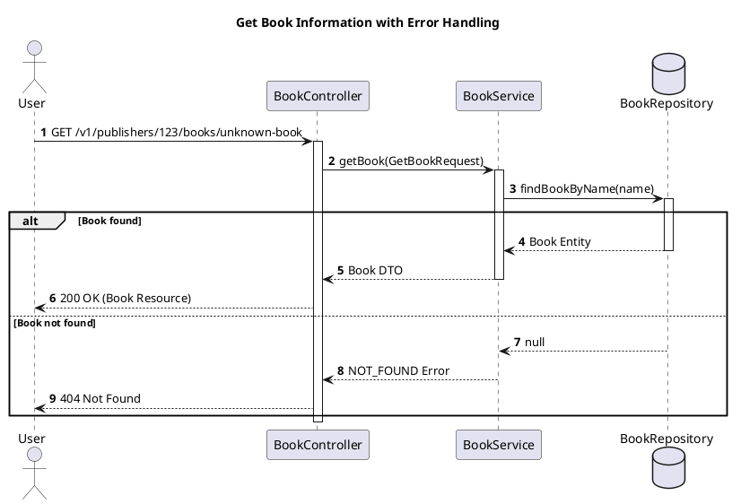

Based on the sequence diagram guides (Visual Paradigm, PlantUML), the Controller-Service-Repository (CSR) architecture pattern, and Google's API Design Guide (AIP) with Resource-Oriented Design (RoD), I have consolidated a **skill set / rule set / workflow** for an agent to design high‑quality sequence diagrams. This skill set will teach the agent how to translate business requirements into规范的 sequence diagrams that respect both CSR layering and RoD principles.

---

## 🧠 Core Design Principles

Before drawing any sequence diagram, the agent must internalise these two fundamental architectural principles:

1. **Controller-Service-Repository (CSR) Pattern**  
   This pattern separates software into three distinct layers by responsibility:

   - **Controller** – the “front desk” of the system. It receives external requests (e.g., HTTP calls) and returns responses. It does **not** contain business logic; it only translates requests into Data Transfer Objects (DTOs) and forwards them to the Service layer.
   - **Service** – the “brain” of the system. It contains **all business logic**. It receives DTOs from the Controller, collaborates with the Repository to fetch or persist data, performs validations, calculations, and transformations, and returns results to the Controller.
   - **Repository** – the “data access” layer. It handles all interactions with the database or other persistent storage, abstracting away the details of data retrieval and storage.

2. **Resource‑Oriented Design (RoD)** – as defined by Google AIPs  
   This API design philosophy models the system’s core functionality as **resources** (nouns) and **methods** (verbs) acting on those resources.

   - **Resources** are the fundamental building blocks (e.g., `Book`, `User`, `Order`). Each resource is identified by a unique **resource name** (e.g., `publishers/123/books/les-miserables`) as per AIP‑122.
   - **Standard methods** are the preferred way to operate on resources: `Get`, `List`, `Create`, `Update`, `Delete` (AIP‑131 to AIP‑135).
   - **Custom methods** (AIP‑136) are used when standard methods are insufficient – for example, `Archive`, `Publish`, `Cancel`. They are typically mapped to `POST` with a colon `:` in the URL (e.g., `:archive`).
   - **State** (AIP‑216) – resource lifecycles are modelled using a `State` enum (e.g., `DRAFT`, `PUBLISHED`, `DELETED`). State transitions must occur via custom methods, not through the generic `Update` method.
   - **Pagination** (AIP‑158) – `List` methods must support pagination using `page_size` and `page_token`.
   - **Errors** (AIP‑193) – APIs must return standardised error messages using `google.rpc.Status` and appropriate gRPC HTTP status codes (e.g., `NOT_FOUND`).

---

## 📐 Sequence Diagram Design Workflow

When designing a sequence diagram, the agent should follow these steps:

### Step 1: Identify the Scenario and Participants
- Start from a concrete **use case** or **operation** (e.g., “User places an order for a book”).
- Identify the external **actors** – usually a **user** or an **external system**. Use the `actor` keyword in PlantUML.
- Identify the internal **lifelines** that participate in the interaction. In CSR, these typically include:
  - `Controller` – the entry point.
  - `Service` – the business logic core.
  - `Repository` – the data access layer.
  - Possibly `DTO` and `Entity` objects.

### Step 2: Plan the Interaction Flow (following CSR)
Define the message flow according to CSR responsibilities:

1. **Request inflow** – `Actor` → `Controller`
2. **Logic handling** – `Controller` → `Service` (passing DTOs)
3. **Data operations** – `Service` → `Repository` (CRUD or custom queries)
4. **Data return** – `Repository` → `Service` (returning Entity or raw data)
5. **Response return** – `Service` → `Controller` (returning result DTO) → `Actor`

### Step 3: Apply RoD Principles to the Interface
When designing the external interface (the messages between `Actor` and `Controller`), strictly adhere to RoD. This directly influences the messages shown in the sequence diagram.

- **Map to standard/custom methods**:
  - **Get a resource** → `Get` method – the sequence diagram shows a `GetResourceRequest` containing the resource `name`, then the `Service` retrieves and returns the resource.
  - **List resources** → `List` method – include `parent`, `page_size`, `page_token` in the request, and `ListResourcesResponse` with `resources` list and `next_page_token`.
  - **Create / Update / Delete** – map to their respective standard methods.
  - **Custom operations** → **custom methods** – e.g., “Archive a book” becomes `ArchiveBook` with `POST /v1/{name=publishers/*/books/*}:archive`.

- **State management** – if the resource has a lifecycle, represent its `State` enum. State transitions are triggered by custom methods, not by `Update`.

- **Error handling** – model both success and failure paths using **`alt`** (alternative) fragments. When an error occurs (e.g., resource not found), the `Service` or `Repository` returns a standard error object, and the `Controller` converts it into the appropriate HTTP status code.

### Step 4: Draw the Sequence Diagram with PlantUML
Translate the design into PlantUML code. Leverage PlantUML’s textual nature for rapid iteration.

**Key PlantUML syntax**:
- Declare participants: `actor`, `participant`, `database`, etc.
- Messages:
  - `->` for synchronous messages (solid arrow)
  - `-->` for return messages (dashed arrow)
  - Use `r:` prefix to annotate return values on the arrow.
- Logical fragments:
  - `alt` / `else` / `end` – if‑then‑else
  - `opt` / `end` – optional
  - `loop` / `end` – loops
- Auto‑numbering: use `autonumber` to add sequential numbers to messages.

---

## 📝 Example: Get Book Information

**Scenario**: A user requests information about a specific book.

**Analysis (CSR + RoD)**:
- Actor: `User`
- Resource: `Book`
- Method: `GetBook` (standard)
- Request: `GetBookRequest` with `name = "publishers/123/books/les-miserables"`
- Response: `Book` resource
- CSR flow: `User` → `BookController` → `BookService` → `BookRepository`

**PlantUML code**:

**Enhanced example with error handling (using `alt`)**:

---

## 🚀 Agent Skill Set Summary

As an agent designing sequence diagrams based on CSR and RoD, you must master the following competencies:

1. **Pattern Recognition & Mapping** – Decompose any business requirement into “resources” and “methods”, and accurately map them to RoD standard or custom methods.

2. **Layered Responsibility** – Enforce CSR boundaries: the `Controller` only handles request/response translation; the `Service` contains all business logic; the `Repository` deals solely with persistence. The message flow in the diagram must clearly show this layering.

3. **Resource Naming** – Design resource names following AIP‑122: use `/` separators, plural for collections, and hierarchical parent/child relationships where appropriate.

4. **State Machine Modelling** – Identify resource states and model their lifecycle using `State` enums and custom methods for authorised state transitions.

5. **Error & Exception Flows** – Proficiently use `alt` and `opt` fragments to model success, failure, and conditional paths, and ensure error responses adhere to AIP‑193.

6. **Pagination for Lists** – When designing `List` methods, automatically include `page_size` and `page_token` in requests and design the response with `next_page_token`.

7. **PlantUML Proficiency** – Quickly translate design thinking into clean, well‑structured PlantUML code, using its textual nature for fast iterations.

8. **AI‑Assisted Design** – Leverage AI by describing scenarios in natural language to generate draft diagrams, then review and refine them. Also, ask AI to analyse existing diagrams for improvements (e.g., converting synchronous calls to asynchronous for better performance).

By internalising this skill set, an agent will be able to produce sequence diagrams that are both architecturally sound (CSR) and API‑compliant (RoD), facilitating clearer communication, better system design, and thorough documentation.