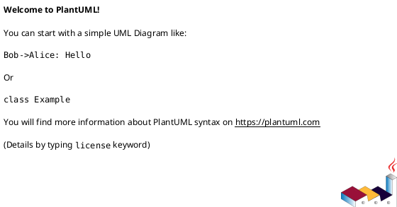

# PlantUML Sequence Diagram Syntax Reference

Quick reference for PlantUML sequence diagram syntax used in CSR-RoD diagrams.

## Table of Contents

1. [Basic Structure](#basic-structure)
2. [Participants](#participants)
3. [Messages](#messages)
4. [Activation Bars](#activation-bars)
5. [Combined Fragments](#combined-fragments)
6. [Notes and Comments](#notes-and-comments)
7. [Loops](#loops)
8. [Groups](#groups)
9. [Parallel](#parallel)
10. [Reference Diagrams](#reference-diagrams)
11. [Divider/Separator](#dividerseparator)
12. [Auto-Numbering](#auto-numbering)
13. [Return Messages](#return-messages)
14. [Complete Minimal Example](#complete-minimal-example)

---

## Basic Structure

Every PlantUML diagram is wrapped in `@startuml` and `@enduml`:



Use `skinparam` for styling (optional but recommended):

```plantuml
@startuml
!theme plain

skinparam backgroundColor #FEFEFE
skinparam sequenceMessageAlign center
skinparam responseMessageBelowArrow true

' ... diagram content ...
@enduml
```

---

## Participants

### Participant Types

| Keyword | Visual |
|---------|--------|
| `actor` | Stick figure |
| `participant` | Rectangle (default) |
| `boundary` | Circle with X |
| `control` | Circle with arrow |
| `entity` | Circle |
| `database` | Cylinder |
| `collections` | Stacked boxes |
| `queue` | Tube with arrow |

### Declaration

```plantuml
actor "API Client" as Client
participant "BookController" as BC
participant "BookService" as BS
participant "BookRepository" as BR
database "PostgreSQL" as DB
```

The `as` keyword creates aliases for shorter references.

### Order

Participants appear in declaration order unless reordered with `participant` before first use:

```plantuml
' Force order even if first message is different:
participant "BookService" as BS
participant "BookController" as BC
participant "BookRepository" as BR

Client -> BC: ' Controller declared after Service but drawn first
```

---

## Messages

### Arrow Types

| Syntax | Meaning |
|--------|---------|
| `->` | Solid line (synchronous call) |
| `-->` | Dashed line (return/response) |
| `->>` | Dotted line (asynchronous call) |
| `-->>` | Dotted return |
| `<-` | Reverse direction (from right to left) |
| `<--` | Reverse return |

### Message Examples

```plantuml
Client -> BC: POST /v1/books
activate BC
BC -> BS: createBook(request)
activate BS
BS -> BR: save(entity)
activate BR
BR -> DB: INSERT ...
activate DB
DB --> BR: result
deactivate DB
BR --> BS: saved entity
deactivate BR
BS --> BC: BookResponse
deactivate BS
BC --> Client: 201 Created + BookResponse
deactivate BC
```

### Multiline Messages

Use `\n` for line breaks in labels:

```plantuml
Client -> BC: POST /v1/books\n{ "title": "X", "author": "Y" }
```

---

## Activation Bars

Activation bars show when a participant is active:

```plantuml
activate Participant   ' Start activation bar
deactivate Participant ' End activation bar
```

Shorthand using `+` and `-` suffixes on arrows:

```plantuml
Client -> BC+: request
BC --> Client-: response
' + after -> = activate on target
' - after --> = deactivate on source
```

Nested activations:

```plantuml
Client -> BC+: request
BC -> BS+: process
BS -> BR+: query
BR --> BS-: result
BS --> BC-: response
BC --> Client: final response
deactivate BC
```

---

## Combined Fragments

### alt / else / end (Alternative)

```plantuml
alt Condition A
    A -> B: message 1
else Condition B
    A -> B: message 2
else Condition C
    A -> B: message 3
end
```

### opt / end (Optional)

```plantuml
opt Optional condition
    A -> B: conditional message
end
```

### loop / end (Loop)

```plantuml
loop For each item
    A -> B: process item
end
```

### break / end (Break)

```plantuml
loop Check items
    A -> B: get item
    break Item invalid
        B --> A: error
    end
    A -> B: process valid item
end
```

### critical / option / end (Critical Region)

```plantuml
critical Critical section
    A -> B: exclusive operation
option Rollback
    A -> B: undo operation
end
```

### par / and / end (Parallel)

```plantuml
par Process A
    A -> B: task 1
and Process B
    A -> C: task 2
end
```

### group / end (Generic Group)

```plantuml
group Transaction Boundary
    A -> B: begin
    B -> C: query
    C --> B: result
    B --> A: commit
end
```

### CSR-RoD Fragment Examples

**Error handling fragment:**

```plantuml
alt Book not found
    BS -> BS: throw new NotFoundException(
               "Book 'books/456' not found")
    BS --> BC: DomainException(NOT_FOUND)
    BC --> Client: 404 Not Found
else Permission denied
    BS -> BS: throw new PermissionDeniedException(
               "Access denied to book")
    BS --> BC: DomainException(PERMISSION_DENIED)
    BC --> Client: 403 Forbidden
else Validation error
    BS -> BS: throw new ValidationException(fieldErrors)
    BS --> BC: DomainException(INVALID_ARGUMENT)
    BC --> Client: 400 Bad Request
end
```

**Auth check fragment:**

```plantuml
opt Authentication required
    BC -> BC: validateToken(authHeader)
    alt Token invalid
        BC --> Client: 401 Unauthorized
        note right: End processing here
    end
end
```

---

## Notes and Comments

### Note Positions

```plantuml
A -> B: message
note left: Note on left of message
note right: Note on right of message
note over A: Note over participant A
note over A, B: Note spanning A and B
```

### Note Shapes

```plantuml
A -> B: message
hnote right of A: HNote = hexagon shape
rnote left of B: RNote = rectangle shape
```

### Floating Notes

```plantuml
note right of A
    Multiline note
    Second line
    * bullet point
end note
```

### Comments

Use `'` for single-line comments (not rendered):

```plantuml
' This is a comment, not shown in diagram
A -> B: visible message
```

---

## Divider/Separator

Use `== Title ==` to create horizontal separators:

```plantuml
== Request Phase ==
Client -> Controller: send request

== Processing Phase ==
Controller -> Service: process

== Response Phase ==
Service --> Controller: result
Controller --> Client: response
```

---

## Auto-Numbering

Enable with `autonumber`:

```plantuml
autonumber
Client -> Controller: request      ' 1
Controller -> Service: process     ' 2
Service --> Controller: result     ' 3
Controller --> Client: response    ' 4
```

Format control:

```plantuml
autonumber 10      ' Start at 10
autonumber 10 5    ' Start at 10, increment by 5
autonumber "<b>[000]"  ' Format with leading zeros
```

---

## Return Messages

Use `return` keyword as shorthand for `-->` back to caller:

```plantuml
Client -> Controller: request
activate Controller
Controller -> Service: process
activate Service
Service -> Repository: query
Repository --> Service: result
deactivate Repository
return                          ' equivalent to: Service --> Controller
return                          ' equivalent to: Controller --> Client
deactivate Controller
```

---

## Reference Diagrams (ref)

Reference another diagram:

```plantuml
A -> B: start
ref over A, B
    This references
    another interaction
end ref
B -> C: continue
```

---

## Create/Destroy Participants

```plantuml
Client -> BookService **: create   ' Creates BookService participant
BookService -> BookRepository **: create

' Later...
BookService !!: destroy            ' Destroys BookService
BookRepository !!: destroy
```

---

## Spacing and Delays

```plantuml
A -> B: message
...delay text...
B -> C: delayed message
||50||      ' 50 pixels of vertical space
C -> D: spaced message
|||         ' Default spacing
```

---

## Title, Header, Footer

```plantuml
title Book Creation Sequence Diagram
header Page header
footer Page %page% of %lastpage%

caption Figure 1: CSR-RoD Create Flow
```

---

## Skinparam Reference (Common)

```plantuml
skinparam sequence {
    ArrowColor #333333
    ActorBorderColor #333333
    LifeLineBorderColor #666666
    LifeLineBackgroundColor #F0F0F0
    ParticipantBorderColor #333333
    ParticipantBackgroundColor #E3F2FD
    BoxBackgroundColor #FAFAFA
}
```

---

## Complete Minimal Example

```plantuml
@startuml
!theme plain

actor "API Client" as Client
participant "BookController" as BC
participant "BookService" as BS
participant "BookRepository" as BR
database "PostgreSQL" as DB

title Book Creation (CSR-RoD Pattern)

== Request ==
Client -> BC+: POST /v1/publishers/123/books
        \n{ "title": "Design Patterns", "author": "GoF" }

== Validation ==
BC -> BC: validate request body
alt Validation failed
    BC --> Client-: 400 Bad Request
        \n{ "error": "Invalid 'title' field" }
end

== Processing ==
BC -> BS+: createBook(parent, request)
BS -> BS: apply business rules
BS -> BS: generate resource name

== Persistence ==
BS -> BR+: save(entity)
BR -> DB+: INSERT ...
DB --> BR-: persisted entity
BR --> BS-: BookEntity

== Response ==
BS -> BS: entity → ResponseDTO
BS --> BC-: BookResponseDTO
BC --> Client-: 201 Created
        \n{ "name": ".../books/abc", "title": "..." }

@enduml
```
