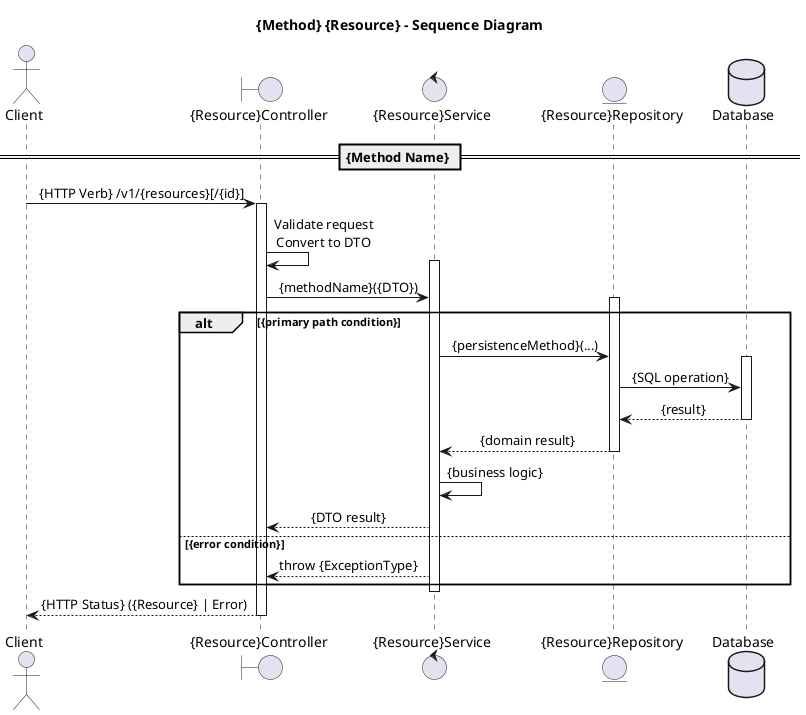

# Sequence Diagram Skill Set for Controller-Service-Repository with Resource-Oriented Design

This is a comprehensive skill set that an agent (or developer) can follow to design, validate, and produce UML sequence diagrams for backend systems built on the **Controller-Service-Repository (CSR)** pattern and **Resource-Oriented Design (RoD)** principles.

---

## 1. Participant Mapping Rules

Every sequence diagram for a CSR+RoD system must declare participants in a fixed order and with consistent naming.

### 1.1 Standard Participant Set (left to right)

| Position | Participant | PlantUML Type | Role |
|----------|------------|---------------|------|
| 1 | **Client** | `actor` | External consumer (user, frontend, third-party) |
| 2 | **API Gateway / Router** | `participant` | Optional: routing, auth, rate limiting |
| 3 | **Controller** | `boundary` | HTTP request/response translation, DTO conversion |
| 4 | **Service** | `control` | Business logic, orchestration, validation |
| 5 | **Repository** | `entity` | Data persistence abstraction |
| 6 | **Database** | `database` | Actual storage |

### 1.2 Naming Conventions

```
actor "Client" as Client
boundary "{Resource}Controller" as Controller
control "{Resource}Service" as Service
entity "{Resource}Repository" as Repository
database "Database" as DB
```

- Controllers, Services, and Repositories are **named after the resource** they manage (e.g., `BookController`, `BookService`, `BookRepository`).
- The resource name follows **RoD collection naming**: lowercase `camelCase`, plural (e.g., `books`, `publishers`).

### 1.3 Additional Participants

When the interaction involves:
- **External APIs**: add `participant` on the right of the Database, named `{Provider}Api`.
- **Message queues / Event buses**: add `queue` participant.
- **Cross-resource interactions**: introduce additional Service/Repository pairs as needed, positioned between the primary Service and Database.

---

## 2. Lifeline and Activation Rules

### 2.1 Activation Alignment with CSR Layers

Each layer activates **only when it is actively processing**:

- **Controller activation** spans from receiving the HTTP request to returning the HTTP response.
- **Service activation** spans from receiving a DTO to returning a result to the Controller.
- **Repository activation** spans from receiving a query/command to returning data to the Service.

### 2.2 Nesting Rule

Activations must nest correctly:
```
Controller activates
  → Service activates (nested inside Controller)
    → Repository activates (nested inside Service)
      → DB responds
    → Repository deactivates
  → Service deactivates
→ Controller deactivates
```

This visually enforces the **dependency direction**: Controller → Service → Repository → Database. **No layer may skip a layer.** A Controller must never call a Repository directly. A Repository must never call a Service.

---

## 3. Resource-Oriented Message Naming

### 3.1 Standard Method Mapping

Every message in the diagram that represents an API operation must follow RoD standard method semantics:

| RoD Standard Method | HTTP Verb | Controller Method | Service Method | Repository Method |
|---|---|---|---|---|
| **Get** | `GET /v1/{resources}/{id}` | `get{Resource}()` | `get{Resource}()` | `findById()` |
| **List** | `GET /v1/{resources}` | `list{Resources}()` | `list{Resources}()` | `findAll()` |
| **Create** | `POST /v1/{resources}` | `create{Resource}()` | `create{Resource}()` | `save()` |
| **Update** | `PATCH /v1/{resources}/{id}` | `update{Resource}()` | `update{Resource}()` | `save()` |
| **Delete** | `DELETE /v1/{resources}/{id}` | `delete{Resource}()` | `delete{Resource}()` | `deleteById()` |

### 3.2 Custom Method Mapping

Custom methods (AIP-136) follow a `verbNoun` pattern and map to a dedicated Service method:

```
Client -> Controller: POST /v1/books/{id}:archive
Controller -> Service: archiveBook(bookId)
Service -> Repository: findById(bookId)
Repository -> Service: book
Service -> Repository: save(updatedBook)
Repository -> Service: savedBook
Service -> Controller: archivedBookDTO
Controller -> Client: 200 OK (archived book)
```

### 3.3 Resource Names in Messages

When a message passes a resource reference, use the **RoD resource name format** in annotations or notes:

```
note right of Controller
  Resource name: publishers/{publisher}/books/{book}
end note
```

---

## 4. DTO Boundary Rules

### 4.1 The DTO Boundary Principle

The Controller layer translates between **external representation** (HTTP/JSON, Protobuf) and **internal representation** (DTOs/Domain objects). This translation must be visible in every sequence diagram.

### 4.2 Message Labeling Convention

| Crossing | Label Pattern | Example |
|---|---|---|
| Client → Controller | HTTP method + resource path | `POST /v1/books` |
| Controller → Service | DTO name or domain action | `createBook(CreateBookDTO)` |
| Service → Repository | Domain object or query | `save(book)` |
| Repository → Database | SQL/query operation | `INSERT INTO books...` |

Return messages use dashed arrows (`-->`) with the return type:

```
Client -> Controller: POST /v1/books (CreateBookRequest)
Controller -> Service: createBook(CreateBookDTO)
Service -> Repository: save(Book entity)
Repository -> DB: INSERT INTO books (...)
DB --> Repository: row
Repository --> Service: Book entity
Service --> Controller: BookDTO
Controller --> Client: 201 Created (Book resource)
```

---

## 5. Standard Operation Templates

### 5.1 Get Resource

```
Client -> Controller: GET /v1/{resources}/{id}
Controller -> Service: getResource(id)
Service -> Repository: findById(id)
Repository -> DB: SELECT ... WHERE id = ?
DB --> Repository: row
Repository --> Service: Resource entity
Service --> Controller: ResourceDTO
Controller --> Client: 200 OK (Resource)
```

### 5.2 List Resources (with Pagination)

```
Client -> Controller: GET /v1/{resources}?page_size=50&page_token=abc
Controller -> Service: listResources(pageSize, pageToken)
Service -> Repository: findAll(pageSize, pageToken)
Repository -> DB: SELECT ... LIMIT ? OFFSET ?
DB --> Repository: rows
Repository --> Service: List<Resource> + nextPageToken
Service --> Controller: List<ResourceDTO> + nextPageToken
Controller --> Client: 200 OK ({ resources: [...], next_page_token: "..." })
```

### 5.3 Create Resource

```
Client -> Controller: POST /v1/{resources} (CreateResourceRequest)
Controller -> Controller: Validate request, convert to DTO
Controller -> Service: createResource(CreateResourceDTO)
Service -> Service: Validate business rules
Service -> Repository: save(Resource entity)
Repository -> DB: INSERT INTO resources (...)
DB --> Repository: persisted row
Repository --> Service: Resource entity
Service --> Controller: ResourceDTO
Controller --> Client: 201 Created (Resource)
```

### 5.4 Update Resource

```
Client -> Controller: PATCH /v1/{resources}/{id} (UpdateResourceRequest)
Controller -> Controller: Validate request, convert to DTO
Controller -> Service: updateResource(id, UpdateResourceDTO)
Service -> Repository: findById(id)
Repository -> DB: SELECT ... WHERE id = ?
DB --> Repository: existing entity
Service -> Service: Apply changes, validate immutable fields (AIP-203)
Service -> Repository: save(updated entity)
Repository -> DB: UPDATE resources SET ...
DB --> Repository: updated row
Repository --> Service: Resource entity
Service --> Controller: ResourceDTO
Controller --> Client: 200 OK (Resource)
```

### 5.5 Delete Resource

```
Client -> Controller: DELETE /v1/{resources}/{id}
Controller -> Service: deleteResource(id)
Service -> Repository: existsById(id)
Repository -> DB: SELECT EXISTS(... WHERE id = ?)
DB --> Repository: true/false
alt resource exists
  Service -> Repository: deleteById(id)
  Repository -> DB: DELETE FROM resources WHERE id = ?
  DB --> Repository: OK
  Service --> Controller: void
  Controller --> Client: 204 No Content
else resource not found
  Service --> Controller: throw ResourceNotFoundException
  Controller --> Client: 404 NOT_FOUND
end
```

---

## 6. Error Handling Patterns (AIP-193)

### 6.1 Error Flow Rule

Every sequence diagram that can fail must include **at least one `alt` fragment** showing the error path. Error responses must use standard gRPC/HTTP codes.

### 6.2 Standard Error Scenarios

| Scenario | gRPC Code | HTTP Code | Diagram Fragment |
|---|---|---|---|
| Resource not found | `NOT_FOUND` (5) | 404 | `alt` on existence check |
| Permission denied | `PERMISSION_DENIED` (7) | 403 | `alt` on auth check |
| Validation failure | `INVALID_ARGUMENT` (3) | 400 | `alt` on input validation |
| Conflict / precondition | `FAILED_PRECONDITION` (9) | 409 | `alt` on state check |
| Child resources present | `FAILED_PRECONDITION` (9) | 409 | `alt` on delete with children |

### 6.3 Error Response Message Pattern

```
Controller --> Client: 404 NOT_FOUND { error: { code: 5, message: "Book not found", details: [{@type: ErrorInfo, reason: "RESOURCE_NOT_FOUND"}] } }
```

---

## 7. State Transition Patterns (AIP-216)

### 7.1 State Transition as Custom Method

When a resource has lifecycle states, the diagram must show:
1. The custom method call (e.g., `:publish`, `:archive`)
2. The current state validation in the Service layer
3. The state transition and any side effects

```
Client -> Controller: POST /v1/books/{id}:publish
Controller -> Service: publishBook(id)
Service -> Repository: findById(id)
Repository --> Service: Book (state: DRAFT)
alt current state == DRAFT
  Service -> Service: setState(PUBLISHED), setPublishTime(now)
  Service -> Repository: save(updatedBook)
  Repository --> Service: Book (state: PUBLISHED)
  Service --> Controller: BookDTO
  Controller --> Client: 200 OK (Book, state: PUBLISHED)
else current state != DRAFT
  Service --> Controller: throw IllegalStateException
  Controller --> Client: 400 INVALID_ARGUMENT { message: "Cannot publish book in state SUSPENDED" }
end
```

### 7.2 State Enum Annotation

Add a note to show the allowed state enum:

```
note over Service
  Book.State:
    DRAFT → PUBLISHED → ARCHIVED
    DRAFT → DELETED
end note
```

---

## 8. Field Behavior Annotations (AIP-203)

When the diagram documents request/response payloads, annotate field behavior in notes:

```
note right of Controller
  CreateBookRequest:
    title     [REQUIRED]
    author    [REQUIRED]
    isbn      [OPTIONAL]
    book_id   [OUTPUT_ONLY]  // system-generated
    name      [IDENTIFIER]   // publishers/{p}/books/{b}
    create_time [OUTPUT_ONLY]
end note
```

This is especially important for **Create** and **Update** diagrams, where the distinction between `REQUIRED`, `OPTIONAL`, `OUTPUT_ONLY`, and `IMMUTABLE` fields drives validation logic in the Service layer.

---

## 9. Interaction Fragment Rules

### 9.1 Fragment-to-Layer Mapping

| Fragment | Used In | Purpose |
|---|---|---|
| `alt` / `else` | Service | Business rule branching, authorization checks, existence checks |
| `opt` | Service | Optional operations (e.g., sending a notification) |
| `loop` | Service or Repository | Iterating over collections, batch operations |
| `par` | Service | Parallel independent operations |
| `critical` | Service | Transactional boundaries |
| `ref` | Any | Reuse of common sub-sequences (e.g., authentication) |

### 9.2 Rule: Fragments Belong to the Service Layer

Interaction fragments (`alt`, `opt`, `loop`) **must** be placed around the Service layer's activation. They represent **business logic decisions**, not Controller routing or Repository queries.

```
Service -> Repository: findById(id)
Repository --> Service: entity or null
alt entity found
  Service -> Service: applyBusinessLogic(entity)
else entity not found
  Service --> Controller: throw NotFoundException
end
```

---

## 10. Cross-Cutting Concerns

### 10.1 Authentication / Authorization

If the system has auth, show it as a `ref` fragment or a dedicated call before the main flow:

```
Client -> Controller: GET /v1/books (with Bearer token)
Controller -> AuthService: validateToken(token)
AuthService --> Controller: userId, roles
```

### 10.2 Caching

If the Repository implements caching, show it as an `alt`:

```
Service -> Cache: get(key)
alt cache hit
  Cache --> Service: cached entity
else cache miss
  Service -> Repository: findById(id)
  Repository -> DB: SELECT ...
  DB --> Repository: row
  Repository --> Service: entity
  Service -> Cache: put(key, entity)
end
```

### 10.3 Event Publishing

If the Service publishes domain events after mutation:

```
Service -> Repository: save(entity)
Repository --> Service: saved entity
Service -> EventBus: publish(ResourceCreatedEvent(entity))
```

---

## 11. PlantUML Template

Below is a ready-to-use PlantUML skeleton for a standard CRUD operation on a RoD resource through a CSR backend:



---

## 12. Validation Checklist

Before finalizing any sequence diagram, verify:

| # | Check | Source |
|---|---|---|
| 1 | Participants are ordered: Client → Controller → Service → Repository → DB | CSR Rule 1.1 |
| 2 | No layer is skipped (Controller never calls Repository directly) | CSR Rule 2.2 |
| 3 | HTTP verb and path match RoD standard method semantics | RoD §3.1 |
| 4 | Resource names use `camelCase` plural collection format | AIP-122 |
| 5 | Request/response messages are visible at the Controller boundary (DTO translation) | §4 |
| 6 | Error paths exist for every operation that can fail | AIP-193 |
| 7 | Error codes use canonical gRPC/HTTP status codes | AIP-193 |
| 8 | State transitions use custom methods with `:verb` URI pattern | AIP-216, AIP-136 |
| 9 | State enum values follow `-ED` / `-ING` / `ACTIVE` conventions | AIP-216 |
| 10 | Pagination is shown for all List operations (page_size, page_token, next_page_token) | AIP-158 |
| 11 | Field behavior (REQUIRED, OUTPUT_ONLY, IMMUTABLE) is annotated for Create/Update | AIP-203 |
| 12 | Activation bars nest correctly (outer = Controller, inner = Service, innermost = Repository) | §2.2 |
| 13 | Response messages use dashed arrows (`-->`) | UML convention |
| 14 | Interaction fragments are placed at the Service layer | §9.2 |
| 15 | Delete operations check for existence and child resources | AIP-135 |

---

This skill set gives an agent a deterministic framework: given a resource name, an HTTP method, and a business scenario, it can produce a correct, standards-compliant sequence diagram that accurately reflects the Controller-Service-Repository flow with Resource-Oriented Design semantics.