# **Controller-Service-Repository (CSR) + Resource-Oriented Design (RoD) Sequence Diagram Skillset**

---

## **1. Core Principles**

### **1.1. CSR Pattern in Sequence Diagrams**
- **Controller**: Receives HTTP requests, validates input, and delegates to the Service layer.
- **Service**: Contains business logic, orchestrates workflows, and interacts with the Repository.
- **Repository**: Handles data persistence (CRUD operations) and database interactions.

**Key Rule:**
> *Every sequence diagram must clearly separate concerns: Controller (request/response), Service (logic), Repository (data).*

---

### **1.2. Resource-Oriented Design (RoD) in Sequence Diagrams**
- **Resources**: Central entities (e.g., `User`, `Order`, `Product`).
- **Standard Methods**: Follow [AIP-131](https://google.aip.dev/131) to [AIP-135](https://google.aip.dev/135) for `Create`, `Get`, `List`, `Update`, `Delete`.
- **Resource Names**: Use [AIP-122](https://google.aip.dev/122) (e.g., `users/{user_id}`).
- **Custom Methods**: Use [AIP-136](https://google.aip.dev/136) for non-CRUD operations (e.g., `CancelOrder`).
- **States**: Model resource lifecycles using [AIP-216](https://google.aip.dev/216).
- **Errors**: Handle errors per [AIP-193](https://google.aip.dev/193) (e.g., `404 Not Found`, `400 Bad Request`).
- **Pagination**: Implement [AIP-158](https://google.aip.dev/158) for `List` operations.

**Key Rule:**
> *Sequence diagrams must reflect RoD principles: resources as nouns, methods as verbs, and consistent naming/behavior.*

---

## **2. Standard Workflows**

### **2.1. Create Resource (AIP-133)**
**PlantUML Example:**
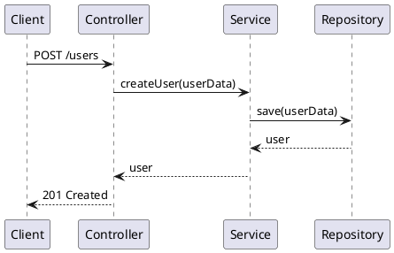

**Rules:**
1. Controller validates `userData`.
2. Service calls Repository to persist data.
3. Return `201 Created` with the new resource.

---

### **2.2. Get Resource (AIP-132)**
**PlantUML Example:**
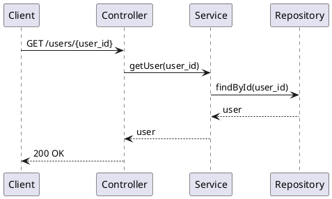

**Rules:**
1. Controller extracts `user_id` from the path.
2. Service fetches resource via Repository.
3. Return `200 OK` or `404 Not Found`.

---

### **2.3. List Resources (AIP-132 + AIP-158)**
**PlantUML Example:**
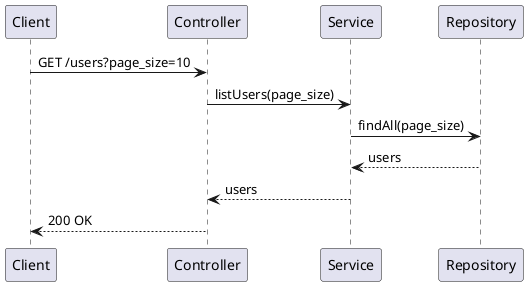

**Rules:**
1. Controller parses query parameters (e.g., `page_size`).
2. Service delegates to Repository for paginated results.
3. Return `200 OK` with a list of resources.

---

### **2.4. Update Resource (AIP-134)**
**PlantUML Example:**
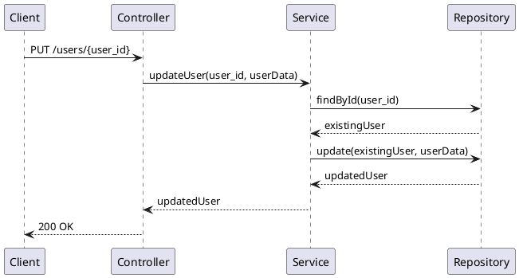

**Rules:**
1. Controller validates `user_id` and `userData`.
2. Service fetches existing resource, applies updates, and persists.
3. Return `200 OK` or `404 Not Found`.

---

### **2.5. Delete Resource (AIP-135)**
**PlantUML Example:**
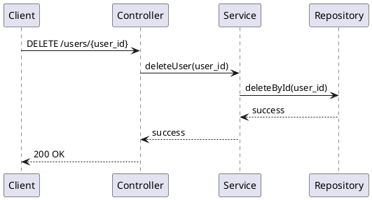

**Rules:**
1. Controller validates `user_id`.
2. Service delegates deletion to Repository.
3. Return `200 OK` or `404 Not Found`.

---

### **2.6. Custom Method (AIP-136)**
**Example: Cancel Order**
**PlantUML Example:**
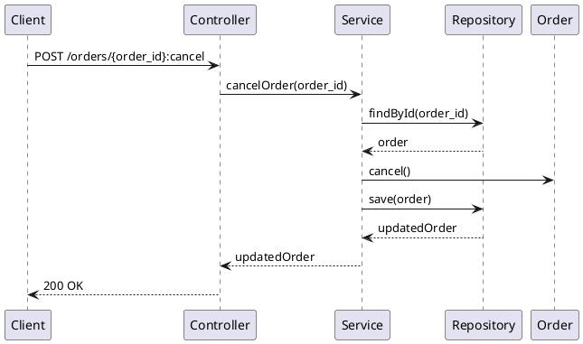

**Rules:**
1. Use `POST` for non-idempotent custom actions.
2. Service orchestrates state change (e.g., `order.cancel()`).
3. Repository persists the updated state.

---

## **3. Advanced Patterns**

### **3.1. Error Handling (AIP-193)**
**PlantUML Example:**
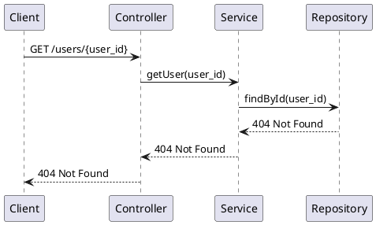

**Rules:**
1. Propagate errors (e.g., `404`, `400`) from Repository → Service → Controller → Client.
2. Use [AIP-193](https://google.aip.dev/193) error codes and messages.

---

### **3.2. Pagination (AIP-158)**
**PlantUML Example:**
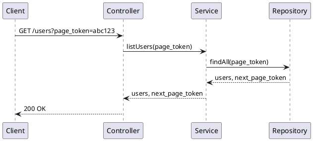

**Rules:**
1. Controller passes `page_token` to Service.
2. Repository returns paginated results + `next_page_token`.
3. Client uses `next_page_token` for subsequent requests.

---

### **3.3. State Transitions (AIP-216)**
**PlantUML Example:**
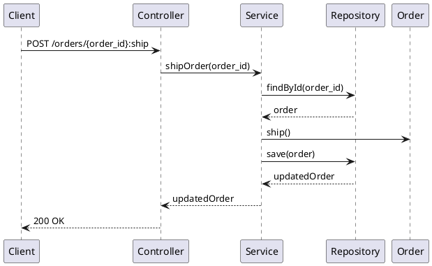

**Rules:**
1. Model state transitions (e.g., `PENDING → SHIPPED`) in Service.
2. Repository persists the new state.

---

### **3.4. Field Masking (AIP-203)**
**PlantUML Example:**
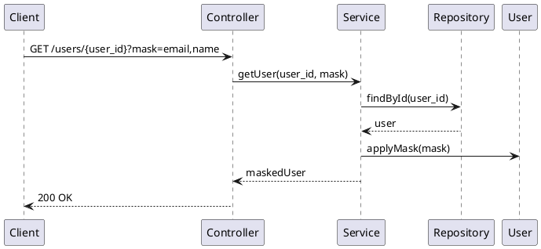

**Rules:**
1. Controller passes `mask` to Service.
2. Service applies field masking before returning data.

---

## **4. PlantUML Best Practices**

### **4.1. Syntax Guidelines**
- Use `->` for synchronous calls, `-->` for returns.
- Group related calls with `alt/else` for conditionals.
- Use `loop` for iterations.
- Annotate with `note left/right` for context.

**Example:**
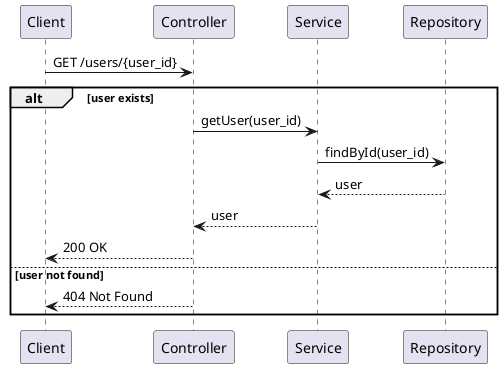

---

### **4.2. Naming Conventions**
- **Controllers**: `[Resource]Controller` (e.g., `UserController`).
- **Services**: `[Resource]Service` (e.g., `UserService`).
- **Repositories**: `[Resource]Repository` (e.g., `UserRepository`).
- **Methods**: Use verbs for actions (e.g., `createUser`, `getUser`).

---

## **5. Anti-Patterns to Avoid**

| **Anti-Pattern**               | **Why It’s Bad**                          | **Fix**                                  |
|--------------------------------|------------------------------------------|------------------------------------------|
| Controller bypasses Service    | Violates separation of concerns         | Always route through Service             |
| Service directly calls DB      | Couples Service to persistence           | Use Repository for DB operations         |
| Repository contains logic      | Violates single responsibility           | Move logic to Service                    |
| Inconsistent resource names    | Breaks RoD standards                     | Follow [AIP-122](https://google.aip.dev/122) |
| Missing error handling         | Poor user experience                     | Implement [AIP-193](https://google.aip.dev/193) |
| No pagination for lists         | Performance issues                       | Use [AIP-158](https://google.aip.dev/158) |

---

## **6. Checklist for Review**

- [ ] **CSR Separation**: Controller, Service, Repository roles are clear.
- [ ] **RoD Compliance**: Resources, methods, and names follow AIPs.
- [ ] **Error Handling**: Errors are propagated and use AIP-193 codes.
- [ ] **Pagination**: `List` operations support pagination (AIP-158).
- [ ] **State Management**: State transitions are modeled (AIP-216).
- [ ] **Field Masking**: Sensitive fields are masked (AIP-203).
- [ ] **PlantUML Clarity**: Diagram is readable and uses proper syntax.
- [ ] **Consistency**: Naming and workflows are consistent across diagrams.

---

## **7. Template for New Diagrams**

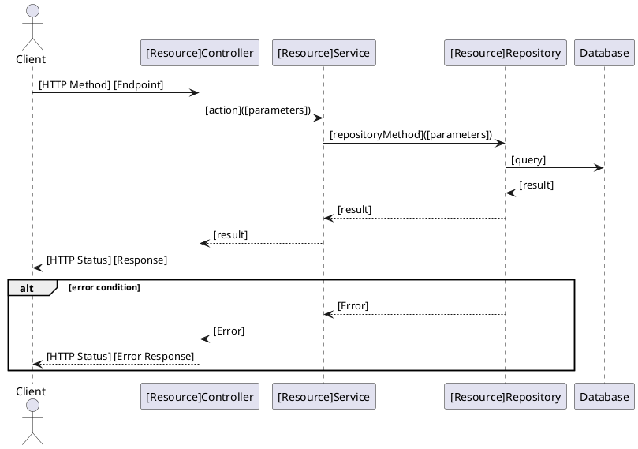

---

## **8. References**
- [UML Sequence Diagrams (Visual Paradigm)](https://www.visual-paradigm.com/guide/uml-unified-modeling-language/what-is-sequence-diagram/)
- [PlantUML Sequence Diagrams](https://plantuml.com/sequence-diagram)
- [CSR Pattern (Sit Blueprint)](https://wiki.sitblueprint.com/books/technical-resources/page/introduction-to-backend-development#bkmrk-controller-service-r)
- [Google AIPs](https://google.aip.dev/)
  - [Resource-Oriented Design (AIP-121)](https://google.aip.dev/121)
  - [Resource Names (AIP-122)](https://google.aip.dev/122)
  - [Standard Methods (AIP-131-135)](https://google.aip.dev/131)
  - [Custom Methods (AIP-136)](https://google.aip.dev/136)
  - [States (AIP-216)](https://google.aip.dev/216)
  - [Errors (AIP-193)](https://google.aip.dev/193)
  - [Pagination (AIP-158)](https://google.aip.dev/158)
  - [Field Behavior (AIP-203)](https://google.aip.dev/203)
Here’s a **comprehensive skillset and workflow** for designing **Controller-Service-Repository (CSR) + Resource-Oriented Design (RoD) sequence diagrams**, grounded in UML standards, PlantUML syntax, and Google’s API Improvement Proposals (AIPs).

---
**You can [edit the canvas here](sandbox/csr-rod-sequence-diagram-skillset) to refine or expand the rules, workflows, or examples.**

---

### **How to Use This Skillset**
1. **Start with the Core Principles** to align your design with CSR and RoD.
2. **Follow the Standard Workflows** for CRUD and custom operations.
3. **Apply Advanced Patterns** for error handling, pagination, state transitions, and field masking.
4. **Use the PlantUML Template** to ensure consistency and clarity.
5. **Avoid Anti-Patterns** and validate your diagrams with the **Checklist**.

---
**Next Steps:**
- Would you like to **iterate on a specific workflow** (e.g., add authentication, async flows)?
- Should we **create a sequence diagram for a real-world scenario** (e.g., e-commerce order processing)?
- Do you want to **extend the skillset** with domain-specific rules (e.g., banking, healthcare)?