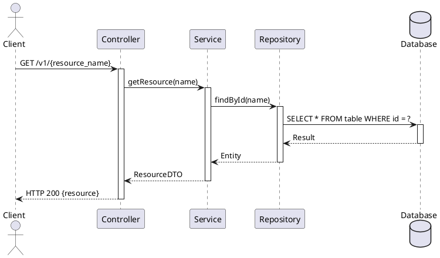
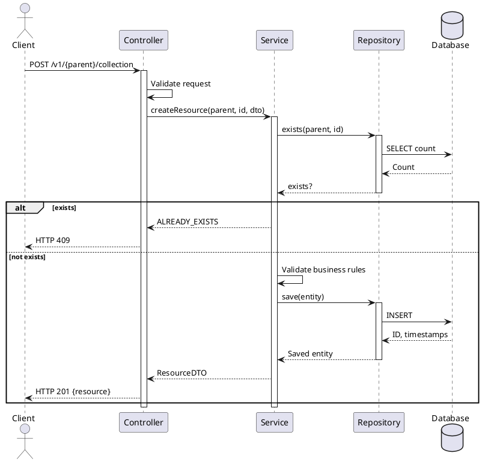

I'll help you create a comprehensive skill set for designing sequence diagrams based on Controller-Service-Repository (CSR) and Resource-oriented Design (RoD) patterns. Let me first extract the key information from your provided sources.


Based on the extracted information from all the sources, I'll create a comprehensive skill/rules/workflow for designing sequence diagrams based on Controller-Service-Repository (CSR) pattern and Resource-oriented Design (RoD) principles.

## **Skill: CSR + RoD Sequence Diagram Design**

### **Core Concepts**

#### **1. Controller-Service-Repository (CSR) Pattern**
- **Controller**: Handles HTTP requests/responses, converts DTOs, delegates to Service
- **Service**: Business logic, data validation, orchestrates Repository calls
- **Repository**: Data persistence, database operations, CRUD operations

#### **2. Resource-oriented Design (RoD) Principles**
- Resources are nouns organized hierarchically
- Standard methods: GET, LIST, CREATE, UPDATE, DELETE
- Custom methods for non-standard operations
- Resource names follow pattern: `{collection}/{id}/{subcollection}/{id}`
- Stateless protocol with strong consistency

#### **3. Sequence Diagram Fundamentals**
- Lifelines represent participants (Controller, Service, Repository, Database)
- Messages show interactions (synchronous, asynchronous, return)
- Activation bars show processing duration
- Fragments model logic (alt, opt, loop, par)

---

### **Workflow for Designing CSR + RoD Sequence Diagrams**

#### **Step 1: Identify the Operation Type**
Determine which standard or custom method is being modeled:
- **GET**: Retrieve single resource
- **LIST**: Retrieve collection with pagination
- **CREATE**: Create new resource
- **UPDATE**: Modify existing resource (PATCH preferred)
- **DELETE**: Remove resource
- **Custom**: State transitions, special operations

#### **Step 2: Define Participants (Lifelines)**
Standard CSR participants in order:
1. **Client/Actor** (external)
2. **Controller** (HTTP layer)
3. **Service** (business logic)
4. **Repository** (data access)
5. **Database/External Service** (persistence)

Optional participants:
- DTO/Validator components
- Cache layer
- Event bus/message queue
- External APIs

#### **Step 3: Model the Flow by Operation Type**

##### **A. GET Operation Flow**
```
Client -> Controller: GET /v1/{resource_name}
Controller -> Service: getResource(id)
Service -> Repository: findById(id)
Repository -> Database: SELECT query
Database --> Repository: Result set
Repository --> Service: Entity/DTO
Service --> Controller: Resource DTO
Controller --> Client: HTTP 200 + Resource JSON
```

**Key Rules:**
- Controller validates request parameters
- Service applies business rules (permissions, transformations)
- Repository handles query construction
- Return NOT_FOUND if resource doesn't exist
- Return PERMISSION_DENIED before checking existence

##### **B. LIST Operation Flow**
```
Client -> Controller: GET /v1/{parent}/collection?page_size=X&page_token=Y
Controller -> Service: listResources(parent, pageSize, pageToken, filters)
Service -> Repository: findPaginated(parent, pageSize, pageToken, filters)
Repository -> Database: SELECT with LIMIT/OFFSET or cursor
Database --> Repository: Result set + next cursor
Repository --> Service: List<Entity> + nextPageToken
Service --> Controller: List<ResourceDTO> + nextPageToken
Controller --> Client: HTTP 200 + {resources: [...], next_page_token: "..."}
```

**Key Rules:**
- Always include pagination (page_size, page_token)
- Support filtering (filter) and ordering (order_by)
- Return next_page_token (empty if last page)
- Coerce page_size to max if exceeded
- Include total_size if available

##### **C. CREATE Operation Flow**
```
Client -> Controller: POST /v1/{parent}/collection {resource_data}
Controller -> Controller: Validate request body
Controller -> Service: createResource(parent, resourceId, resourceDTO)
Service -> Service: Validate business rules
Service -> Repository: exists(parent, resourceId)
Repository -> Database: SELECT count
Database --> Repository: Count
alt Resource exists
    Repository --> Service: true
    Service --> Controller: ALREADY_EXISTS error
    Controller --> Client: HTTP 409
else Resource doesn't exist
    Repository --> Service: false
    Service -> Repository: save(entity)
    Repository -> Database: INSERT
    Database --> Repository: Generated ID/timestamps
    Repository --> Service: Saved entity
    Service --> Controller: Resource DTO
    Controller --> Client: HTTP 201 + Resource JSON
end
```

**Key Rules:**
- Validate required fields and field_behavior annotations
- Check for duplicates (ALREADY_EXISTS vs PERMISSION_DENIED)
- Allow user-specified or system-generated IDs
- Return created resource with all fields
- Use long-running operations for slow creates

##### **D. UPDATE Operation Flow**
```
Client -> Controller: PATCH /v1/{resource_name} {update_data, update_mask}
Controller -> Controller: Validate update_mask and fields
Controller -> Service: updateResource(resourceName, resourceDTO, updateMask)
Service -> Repository: findById(resourceName)
Repository -> Database: SELECT
Database --> Repository: Entity
alt Resource not found
    Repository --> Service: null
    Service --> Controller: NOT_FOUND error
    Controller --> Client: HTTP 404
else Resource exists
    Repository --> Service: Entity
    Service -> Service: Apply update_mask fields
    Service -> Service: Validate immutable fields
    Service -> Repository: update(entity)
    Repository -> Database: UPDATE
    Database --> Repository: Updated entity
    Repository --> Service: Updated entity
    Service --> Controller: Resource DTO
    Controller --> Client: HTTP 200 + Resource JSON
end
```

**Key Rules:**
- Use PATCH (not PUT) for partial updates
- Support update_mask for field selection
- Check etag if provided (ABORTED on mismatch)
- Reject changes to IMMUTABLE fields (INVALID_ARGUMENT)
- Ignore OUTPUT_ONLY fields in update_mask
- Support allow_missing for upsert behavior

##### **E. DELETE Operation Flow**
```
Client -> Controller: DELETE /v1/{resource_name}
Controller -> Service: deleteResource(resourceName, force)
Service -> Repository: findById(resourceName)
Repository -> Database: SELECT
Database --> Repository: Entity
alt Resource not found
    Repository --> Service: null
    alt allow_missing
        Service --> Controller: Success (no-op)
        Controller --> Client: HTTP 204
    else
        Service --> Controller: NOT_FOUND error
        Controller --> Client: HTTP 404
    end
else Resource exists
    Repository --> Service: Entity
    alt Has children and not force
        Service --> Controller: FAILED_PRECONDITION error
        Controller --> Client: HTTP 400
    else
        Service -> Repository: delete(entity)
        Repository -> Database: DELETE
        Database --> Repository: Success
        Repository --> Service: void
        Service --> Controller: void
        Controller --> Client: HTTP 204
    end
end
```

**Key Rules:**
- Check PERMISSION_DENIED before existence
- Fail with FAILED_PRECONDITION if children exist (unless force=true)
- Support soft delete (return resource with DELETED state)
- Support cascading delete with force flag
- Support allow_missing for idempotent deletes

##### **F. Custom Method Flow (State Transition Example)**
```
Client -> Controller: POST /v1/{resource_name}:publish
Controller -> Service: publishResource(resourceName)
Service -> Repository: findById(resourceName)
Repository -> Database: SELECT
Database --> Repository: Entity
alt State != DRAFT
    Repository --> Service: Entity
    Service --> Controller: FAILED_PRECONDITION error
    Controller --> Client: HTTP 400
else State == DRAFT
    Repository --> Service: Entity
    Service -> Service: Validate transition rules
    Service -> Service: Update state to PUBLISHED
    Service -> Repository: update(entity)
    Repository -> Database: UPDATE
    Database --> Repository: Updated entity
    Repository --> Service: Updated entity
    Service --> Controller: Resource DTO
    Controller --> Client: HTTP 200 + Resource JSON
end
```

**Key Rules:**
- Use POST for state transitions
- Name: verb + singular resource name (e.g., PublishBook)
- URI: `{resource_name}:{verb}`
- Validate current state before transition
- Return FAILED_PRECONDITION if transition invalid
- Use past participle for completed states (PUBLISHED, DELETED)
- Use present participle for in-progress states (PUBLISHING)

---

### **Validation Rules for Sequence Diagrams**

#### **1. CSR Layer Responsibilities**
✓ Controller: HTTP handling, DTO conversion, response formatting
✓ Service: Business logic, validation, orchestration
✓ Repository: Database queries, data persistence
✗ Controller should NOT contain business logic
✗ Service should NOT handle HTTP concerns
✗ Repository should NOT contain business rules

#### **2. RoD Compliance**
✓ Resource names follow `{collection}/{id}` pattern
✓ Standard methods use correct HTTP verbs
✓ Error responses use google.rpc.Status format
✓ Pagination included in all LIST operations
✓ Field behavior annotations respected (REQUIRED, OPTIONAL, OUTPUT_ONLY, IMMUTABLE)

#### **3. Sequence Diagram Quality**
✓ All lifelines clearly labeled
✓ Messages named clearly (method names)
✓ Return messages shown for synchronous calls
✓ Alt/opt/loop fragments for conditional logic
✓ Activation bars show processing duration
✓ Error paths explicitly modeled

---

### **Templates and Examples**

#### **Template: Standard GET Request**


#### **Template: CREATE with Validation**


---

### **Best Practices Checklist**

#### **Before Creating Diagram:**
- [ ] Identify operation type (GET/LIST/CREATE/UPDATE/DELETE/Custom)
- [ ] Define all participants (Controller, Service, Repository, DB)
- [ ] Identify error scenarios (NOT_FOUND, PERMISSION_DENIED, etc.)
- [ ] Determine if pagination needed (LIST operations)
- [ ] Identify conditional logic (alt/opt fragments)

#### **During Creation:**
- [ ] Use clear, descriptive message names
- [ ] Show activation bars for all processing
- [ ] Include return messages for all synchronous calls
- [ ] Model error paths explicitly
- [ ] Use fragments for loops, conditionals, parallel processing
- [ ] Label all lifelines clearly

#### **After Creation:**
- [ ] Verify CSR separation of concerns
- [ ] Check RoD compliance (resource names, HTTP verbs, errors)
- [ ] Ensure all error codes match AIP-193
- [ ] Validate pagination implementation (if LIST)
- [ ] Confirm field behavior annotations respected
- [ ] Review for completeness (happy path + error paths)

---

### **Common Patterns and Anti-Patterns**

#### **Good Patterns:**
1. **Thin Controller**: Controller only handles HTTP, delegates immediately
2. **Rich Service**: Service contains all business logic and validation
3. **Focused Repository**: Repository only handles data access
4. **Explicit Error Handling**: All error paths modeled with correct codes
5. **Pagination by Default**: All LIST operations include pagination

#### **Anti-Patterns to Avoid:**
1. **Fat Controller**: Business logic in Controller layer
2. **Smart Repository**: Business rules in Repository layer
3. **Missing Error Paths**: Only happy path modeled
4. **No Pagination**: LIST operations without pagination
5. **Direct DB Access**: Controller or Service accessing database directly
6. **Inconsistent Naming**: Not following RoD naming conventions

---

### **Error Handling Reference**

| Scenario | HTTP Code | gRPC Code | When to Use |
|----------|-----------|-----------|-------------|
| Resource not found | 404 | NOT_FOUND | After permission check |
| Permission denied | 403 | PERMISSION_DENIED | Before existence check |
| Invalid argument | 400 | INVALID_ARGUMENT | Validation failures |
| Already exists | 409 | ALREADY_EXISTS | Duplicate resource |
| State conflict | 400 | FAILED_PRECONDITION | Invalid state transition |
| Etag mismatch | 409 | ABORTED | Optimistic locking |
| Precondition failed | 400 | FAILED_PRECONDITION | Children exist on delete |

---

This comprehensive skill provides an agent with everything needed to design sequence diagrams that properly implement the Controller-Service-Repository pattern while adhering to Google's Resource-oriented Design principles. The workflow, templates, validation rules, and best practices ensure consistent, high-quality sequence diagrams for API design and documentation.